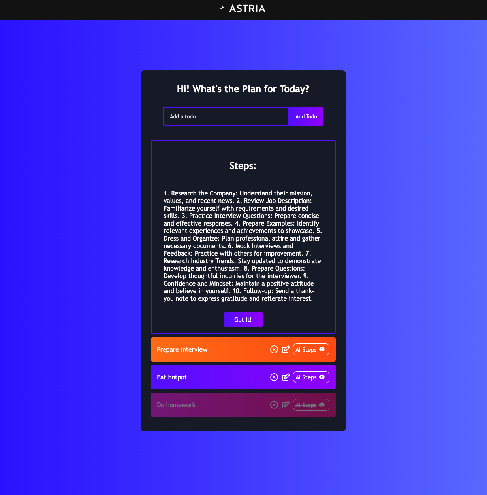

# Hi Astria Team!

Nice to see you here!

## Framework:

React

## Available Scripts

In the project directory, you can run:

### `npm i`

Please install all the dependencies before running

### Run Frontend(Client) at `npm start`

Runs the app in the development mode.\
Open [http://localhost:3000](http://localhost:3000) to view it in your browser.

The page will reload when you make changes.\
You may also see any lint errors in the console.

### Run Server at `node server.js`

Just to make it easy, usually the server file shoule be placed under /server folder, in this case cd to the /src folder to run the server.js for the backend.

### Reminder:

Placed the Openai API keys in .env file. Ask me if you have any question.

### Screenshot:

